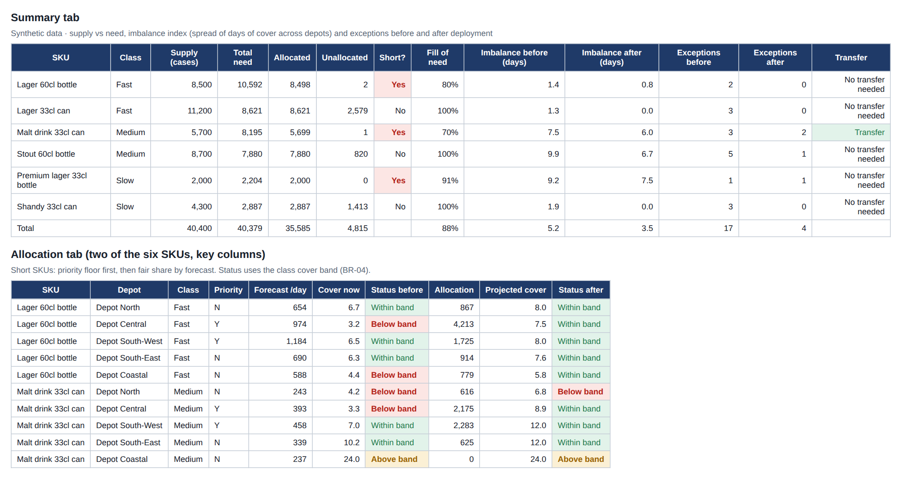
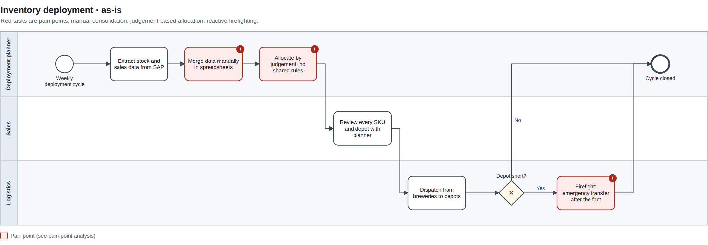
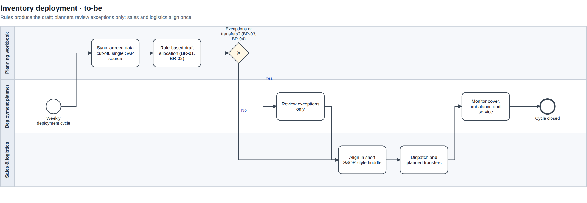

# Inventory Deployment Planner

**Business analysis portfolio project · Chiamaka Ikpo**

A rule-based Excel planner that deploys brewery stock to depots, flags only the exceptions planners need to review, and suggests inter-depot transfers before a depot runs short. It turns the to-be process and business rules from my [inventory deployment case study](https://chiamakaikpo.github.io/case-inventory-deployment.html) into a working tool.

> **Basis:** my experience as a Country Inventory Deployment Planner (and previously Material Requirement Planner) at a global FMCG brewer. The organisation is anonymised. **All data in the workbook is synthetic**: a fictional national brewer with 5 depots and 6 SKUs.



## The problem

Finished goods from several breweries had to be allocated to distribution depots across the country. Allocation was done in spreadsheets, by judgement, with no shared rules. The result was shortages in some depots and excess in others at the same time, plus costly emergency transfers after the fact.

## As-is and to-be





Both maps are BPMN 2.0 files ([`process/`](process/)) that open in [bpmn.io](https://demo.bpmn.io) or Camunda Modeler.

## Business rules the planner implements

| ID | Rule |
|---|---|
| BR-01 | Each depot has a target days-of-cover band per SKU class (fast / medium / slow movers). |
| BR-02 | When supply is short, allocate in proportion to forecast demand, with a minimum floor for priority depots. |
| BR-03 | Suggest an inter-depot transfer only when projected excess at one depot covers a projected shortfall at another within the transfer lead time. |
| BR-04 | A depot/SKU is flagged as an exception when projected cover falls outside its band. |

## What's in the workbook

[`planner/Deployment_Planner.xlsx`](planner/Deployment_Planner.xlsx). Every result is an Excel formula, so changing an input recalculates the plan.

| Tab | Purpose |
|---|---|
| Read me | Rules, how to use, colour key |
| Summary | Supply vs need, imbalance index and exceptions before vs after, KPIs for the cycle |
| Inputs | Cover bands, priority floor, transfer lead time, priority depots, brewery stock available (blue = editable) |
| Stock | Forecast, stock on hand and in transit by SKU and depot |
| Allocation | Need, priority floor, fair share, allocation, projected cover and exception status per depot/SKU |
| Transfers | BR-03 transfer suggestions with the reason when a transfer is not suggested |

## Results (synthetic scenario)

- Exceptions to review: **17 → 4** of 30 depot/SKU rows
- Average imbalance index (spread of days of cover across depots): **5.2 → 3.5 days**
- All stock used on the 3 short SKUs
- 1 transfer suggested: 53 cases of Malt drink 33cl, Depot Coastal → Depot North

The analysis also surfaced a question for stakeholders: allocating in proportion to forecast does not equalise cover between depots. See [`docs/analysis.md`](docs/analysis.md) for the pain-point analysis, how each rule is calculated, KPI definitions and this finding.

## Tested

[`tests/test_planner.py`](tests/test_planner.py) re-implements the four rules in Python and checks the workbook's results line by line. It also checks that the plan never allocates more than supply, never gives a depot more than it needs, and uses all stock when a SKU is short.

```bash
pip install openpyxl numpy
python scripts/build_planner.py        # rebuild the workbook (then open and save it in Excel to calculate)
python tests/test_planner.py           # all 5 checks should pass
python scripts/build_process_maps.py   # rebuild the BPMN maps (run from scripts/)
```

## Tools

Excel (INDEX/MATCH, SUMIF/SUMIFS, SUMPRODUCT, MAXIFS, conditional formatting, data validation) · BPMN 2.0 · Python · SAP S/4HANA (source of the stock and forecast extract in the real process)
